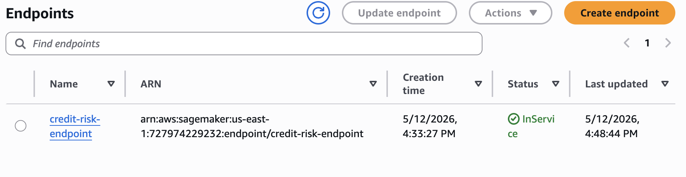

# Credit Risk Prediction with Counterfactual Explanations

End-to-end machine learning system for predicting mortgage default risk, with fairness evaluation, actionable counterfactual explanations, and a production serving layer deployed on AWS SageMaker.

---

## Overview

Built on 148,670 loan applications, this project trains and deploys two classifiers — a 3-layer MLP and XGBoost — to predict the probability that a borrower will default. Beyond prediction, the system generates counterfactual explanations for declined applications: the minimum changes to loan structure that would flip the predicted outcome from default to no-default.

A key focus throughout was distinguishing genuine risk signals from data artifacts. A systematic feature audit identified five features that encoded deterministic lookup rules rather than borrower risk, including the EQUI credit bureau category exhibiting a 100% default rate across 15,000 cases. Removing these features produced a cleaner, more generalizable model.

---

## Results

### Model Performance

| Metric | MLP | XGBoost |
|--------|-----|---------|
| AUC-ROC (test) | 0.9011 | 0.9009 |
| AUC-PR (test) | 0.8499 | 0.8502 |
| Brier Score (calibrated) | 0.0816 | 0.0823 |
| Calibration Gap | 0.24% | 0.22% |

Both models are calibrated using Platt scaling to correct the upward probability bias introduced by pos_weight loss reweighting — not as a post-hoc fix for data distribution shift.

### Fairness

| Group | Calibration Gap | AUC-ROC | Disparate Impact |
|-------|----------------|---------|-----------------|
| Gender | < 1.2% | 0.887–0.910 | 1.021 (passes 80% rule) |
| Age | < 3.1% | 0.890–0.925 | — |
| Region | < 1.1% | 0.879–0.906 | — |

### Counterfactual Explanations

- 10 high-risk cases selected across the 0.55–0.95 probability range
- 9/10 cases received actionable counterfactuals — average 2.5 feature changes required
- 1 case intentionally retained with no counterfactual found: risk driven by immutable borrower characteristics rather than loan structure, demonstrating the system distinguishes between restructurable and non-restructurable risk
- Most commonly modified features: loan_amount (67%), dtir1 (56%), ltv (54%)

---

## Methodology

### Feature Audit and Artifact Removal

Before modelling, every categorical feature was audited for near-deterministic associations with the target. Five features were removed:

| Feature | Reason |
|---------|--------|
| credit_type | EQUI bureau: 100% default rate, n=15,298 — encodes loan program, not borrower risk |
| co-applicant_credit_type | Administrative metadata — which bureau was queried |
| security_type | "Indriect" (typo) category: 100% default, n=33 — same artifact cluster |
| construction_type | "mh" category: 100% default, n=33 — same artifact cluster |
| secured_by | "land" category: 100% default, n=33 — same artifact cluster |

Final feature set: 56 features (8 numeric, 1 binary, 47 one-hot encoded).

### Preprocessing Pipeline

1. Winsorize loan_amount, income, property_value at raw bounds
2. Log-transform those three features
3. Winsorize ltv and dtir1 at 1st/99th percentiles
4. Derive binary is_standard_term (term == 360)
5. StandardScaler on numeric features, OneHotEncoder on categoricals

Class imbalance handled via pos_weight in BCEWithLogitsLoss rather than SMOTE, preserving the real training distribution (24.6% default rate) and avoiding distribution shift at inference.

### MLP Architecture

```
Input: 56 features
  → Linear(128) → BatchNorm → ReLU → Dropout(0.3)
  → Linear(64)  → BatchNorm → ReLU → Dropout(0.2)
  → Linear(32)  → BatchNorm → ReLU → Dropout(0.1)
  → Linear(1)
```

Trained with BCEWithLogitsLoss + pos_weight=3.06, Adam optimizer, early stopping (patience=15).

### XGBoost

500 estimators, depth=5, lr=0.05, scale_pos_weight=3.06, early stopping at 30 rounds. Calibrated with Platt scaling on the validation set.

---

## Production Serving

The model is deployed as a REST API on AWS SageMaker using a custom Docker container.



```
POST /predict          → calibrated default probability + risk level (~5ms)
POST /predict/explain  → probability + DiCE counterfactual recommendations (~2-5s)
GET  /ping             → health check (SageMaker)
GET  /monitoring/drift → Evidently drift report on buffered live traffic
```

### Monitoring and Retraining

Incoming requests are logged and compared against the training distribution using Evidently. Retraining is recommended when:
- More than 30% of features show statistical drift
- Predicted default rate shifts more than 5 percentage points from the 24.6% training baseline

### Local Setup

```bash
git clone https://github.com/sanjxksl/credit-risk-counterfactual.git
cd credit-risk-counterfactual/serving
pip install -r requirements.txt
MODEL_DIR=../models uvicorn app.main:app --reload --port 8080
```

Interactive API docs available at `http://localhost:8080/docs`.

### SageMaker Deployment

```bash
cd serving
python3 sagemaker_deploy.py --bucket your-s3-bucket --region us-east-1
```

---

## Project Structure

```
credit-risk-counterfactual/
├── data/
│   ├── cleaned_loan_data.csv          # Post-cleaning, pre-split
│   ├── train.csv, val.csv, test.csv   # 80/10/10 stratified splits (56 features)
│   └── high_risk_cases.csv            # 10 selected cases for counterfactual analysis
├── models/
│   ├── mlp_model.pth                  # Trained MLP (AUC 0.901)
│   ├── xgboost_model.json             # Trained XGBoost (AUC 0.901)
│   ├── calibrator.pkl                 # MLP Platt scaling calibrator
│   ├── xgboost_calibrator.pkl         # XGBoost Platt scaling calibrator
│   ├── preprocessor.pkl               # Fitted ColumnTransformer
│   ├── winsorize_bounds.json          # ltv/dtir1 clip bounds
│   ├── raw_winsorize_bounds.json      # loan_amount/income/property_value clip bounds
│   └── training_meta.json             # pos_weight and feature metadata
├── notebooks/
│   ├── EDA.ipynb                              # Exploratory analysis + feature audit
│   ├── data_cleaning.ipynb                    # Missing values, log transforms
│   ├── feature_engineering.ipynb              # Splits, scaling, OHE
│   ├── mlp_training.ipynb                     # MLP training + calibration
│   ├── xgboost_training.ipynb                 # XGBoost training + calibration
│   ├── model_evaluation.ipynb                 # MLP vs XGBoost comparison
│   ├── bias_fairness_analysis.ipynb           # Fairness across demographic groups
│   ├── generate_counterfactuals.ipynb         # DiCE counterfactual generation
│   └── counterfactual_summary_statistics.ipynb # CF analysis and visualizations
├── results/
│   ├── mlp_predictions.csv, mlp_metrics.json
│   ├── xgboost_predictions.csv, xgboost_metrics.json
│   ├── bias_gender.csv, bias_age.csv, bias_region.csv
│   ├── dice_counterfactuals/
│   └── figures/
├── serving/
│   ├── app/
│   │   ├── main.py          # FastAPI application
│   │   ├── pipeline.py      # Inference pipeline
│   │   ├── schemas.py       # Pydantic input/output validation
│   │   ├── counterfactuals.py # DiCE integration
│   │   └── monitoring.py    # Evidently drift detection + retraining trigger
│   ├── Dockerfile
│   ├── requirements.txt
│   ├── sagemaker_deploy.py
│   └── test_local.py
└── README.md
```

---

## Notebook Order

1. `EDA.ipynb` — understand the data, run the feature audit
2. `data_cleaning.ipynb` — handle missing values, log transforms
3. `feature_engineering.ipynb` — splits, scaling, encoding
4. `mlp_training.ipynb` — train the neural network
5. `xgboost_training.ipynb` — train XGBoost
6. `model_evaluation.ipynb` — compare both models
7. `bias_fairness_analysis.ipynb` — fairness evaluation
8. `generate_counterfactuals.ipynb` — DiCE explanations
9. `counterfactual_summary_statistics.ipynb` — summarise CF results

---

## Key Design Decisions

**Why pos_weight instead of SMOTE**
SMOTE resamples training data to 33.3% default rate, requiring Platt scaling as a correction at inference time. pos_weight rebalances gradients without changing the data distribution — the training set stays at the observed 24.6% rate, making calibration straightforward and inference honest.

**Why Platt scaling is legitimate here**
pos_weight biases raw sigmoid outputs upward by design. Platt scaling on the validation set corrects this known artifact. This is different from using Platt scaling to fix a SMOTE-induced distribution shift, which would be circular.

**Why counterfactual failures are kept**
One case (predicted probability 0.94) returned no feasible counterfactuals. This is retained deliberately — it demonstrates that the system distinguishes between risk driven by adjustable loan structure versus risk driven by the borrower's underlying financial profile.

---

## Limitations

- Dataset limited to 2019 loan applications from one originator
- North-East region has only 1,235 test samples — fairness estimates less reliable there
- Counterfactual generation assumes feature changes are independent (changing loan_amount and ltv simultaneously may not be realistic)
- Monitoring runs in memory — production deployment requires persistent logging to S3

---

## Databricks Integration

The `databricks/` folder contains two notebooks designed to run on Databricks Community Edition.

### 01_spark_eda.py — Spark EDA

Loads the full 148,670-row dataset with Spark and runs the categorical feature audit using `groupBy` aggregations. Identifies the five artifact features (EQUI bureau, 33-loan cluster) before any modelling.

### 02_mlflow_training.py — MLflow Experiment Tracking

Trains both MLP and XGBoost and logs every run to Databricks MLflow:

- **Per-epoch metrics** for the MLP: `val_auc_roc` and `train_loss` at each step, visible as a learning curve in the Experiments UI
- **Final metrics** for both models: AUC-ROC, AUC-PR, Brier score (calibrated and uncalibrated), calibration gap
- **Hyperparameters**: full parameter set logged for reproducibility
- **Artifacts**: trained model + Platt calibrator saved as MLflow model artifacts
- **Model Registry**: best model registered as `credit-risk-default-predictor`

### Setup

```bash
# 1. Upload data to DBFS (requires Databricks CLI: pip install databricks-cli)
databricks fs cp data/cleaned_loan_data.csv dbfs:/FileStore/credit-risk/cleaned_loan_data.csv
databricks fs cp data/train.csv             dbfs:/FileStore/credit-risk/train.csv
databricks fs cp data/val.csv               dbfs:/FileStore/credit-risk/val.csv
databricks fs cp data/test.csv              dbfs:/FileStore/credit-risk/test.csv
databricks fs cp models/training_meta.json  dbfs:/FileStore/credit-risk/training_meta.json

# 2. Import notebooks into Databricks
#    Workspace → Import → select databricks/01_spark_eda.py and 02_mlflow_training.py

# 3. Install cluster libraries
#    Compute → your cluster → Libraries → Install New → PyPI:
#    torch, xgboost, scikit-learn==1.3.2
```

---

## References

1. Mothilal et al. (2020). Explaining machine learning classifiers through diverse counterfactual explanations. *FAT\* 2020*.
2. Platt (1999). Probabilistic outputs for support vector machines. *Advances in large margin classifiers*.

---

## License

MIT
